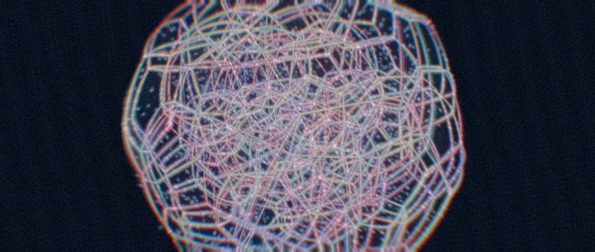

# NTH

[English](README.md) | [日本語](README.ja.md) | Français

**NTH est un outil VJ pour les formes à quatre dimensions.** Il tourne dans le navigateur et rend des polytopes 4D en direct sur le GPU, projetés en 3D, si bien qu'ils se retournent sur eux-mêmes en tournant.  
Conçu pour la scène ; agréable aussi à simplement regarder.

- **Regarder** : ouvrez **[nth-blue.vercel.app](https://nth-blue.vercel.app/)** dans Chrome sur Mac ou PC et appuyez sur **Demo** dans la barre en bas. Une minute, sans rien installer.
- **Piloter** : pilotez-le au clavier, avec un contrôleur MIDI ou au micro, et gardez un set dans neuf emplacements de preset. Voir [Commandes](#commandes).
- **Lire** : les maths et la chaîne de rendu sont dans [docs/how-it-works.md](docs/how-it-works.md) (en anglais), les coûts par image dans [docs/perf.md](docs/perf.md).



NTH prend les 24 polytopes réguliers et semi-réguliers de dimension 4, les fait tourner dans les six plans de l'espace 4D, les place sur la 3-sphère puis les projette en 3D à chaque image.  
Les arêtes sont dessinées comme des tubes lumineux, les faces comme du verre, avec des particules qui parcourent les arêtes, de la poussière qui dérive dans l'espace et une chaîne de post-traitement conçue pour la scène.

## Commandes

Bougez la souris pour afficher la liste des touches en bas de l'écran.

| Touche    | Action                                                        |
| --------- | ------------------------------------------------------------- |
| Espace    | polytope suivant (aléatoire)                                  |
| A         | rafale de turbulence                                          |
| S         | nouvelle rotation 4D et nouvelle orbite de caméra             |
| R         | slit-scan                                                     |
| T         | trou de ver (zoom caméra + lentille)                          |
| Q / W / E | aucun effet / répétition / miroir                             |
| Z         | inversion des couleurs                                        |
| Shift     | maintenir pour reculer la caméra                              |
| M         | réactivité audio via le micro                                 |
| 1–9       | rappeler un emplacement de preset                             |
| H         | panneau de contrôle (curseurs, presets, perf, URL de partage) |

**MIDI** : branchez un KORG nanoKONTROL2 (un petit boîtier USB à huit faders et huit boutons rotatifs) et son mappage par défaut fonctionne aussitôt : faders pour la distance, la rotation et l'intensité des effets, boutons pour les touches ci-dessus (`src/midi/nanokontrol2.json`).  
Tout autre contrôleur convient aussi : copiez ce fichier et adaptez les numéros de control change.

**Partager un rendu** : **copy link** dans le panneau donne une URL qui rouvre NTH exactement dans l'état actuel.

## Prérequis

- Un navigateur de bureau avec WebGPU (Chrome ou Edge). Safari et Firefox basculent sur WebGL2, sans particules ni poussière.
- Les téléphones et tablettes affichent une galerie statique.
- Pour le développement : Node.js 22.12 ou plus récent (voir `.nvmrc`) et pnpm 10.

## Développement

```sh
pnpm install
pnpm dev          # http://localhost:5173
pnpm test         # tests unitaires (Vitest)
pnpm test:e2e     # tests navigateur (Playwright, utilise le Chrome installé)
pnpm build        # site statique dans dist/
```

La CI exécute le lint, la vérification des types, les tests unitaires, le build et un sous-ensemble (smoke) des tests navigateur avec un rendu WebGL logiciel.

## Performance

`pnpm bench` mesure le temps CPU et GPU, le nombre de draw calls et la VRAM par polytope et par effet sur votre machine.  
Voir [docs/perf.md](docs/perf.md) pour les prérequis et les valeurs de référence actuelles.

## Pile technique

| Couche          | Choix                                           |
| --------------- | ----------------------------------------------- |
| Build           | Vite + TypeScript + pnpm                        |
| Rendu           | three.js WebGPURenderer (repli WebGL2)          |
| Shaders         | TSL (Three Shading Language)                    |
| Calcul GPU      | compute shaders WebGPU                          |
| Post-traitement | nœuds PostProcessing de three.js + nœuds personnalisés |
| Entrées         | clavier, Web MIDI API, Web Audio API            |
| UI              | Tweakpane                                       |
| Tests           | Vitest, Playwright                              |

## Déploiement

N'importe quel hébergeur statique convient ; le site doit être servi en HTTPS.  
Le site public est sur Vercel (build `pnpm build`, sortie `dist`).  
Pour un hébergement sous un sous-chemin, construisez avec `BASE_PATH=/sous-chemin/`.

## Crédits

- Morceau de démo : « Ricochet » de Rob Gasser [NCS Release], [NoCopyrightSounds](https://ncs.io/Ricochet).  
Voir [public/demo/LICENSE.txt](public/demo/LICENSE.txt).
- [three.js](https://threejs.org/), [Tweakpane](https://tweakpane.github.io/docs/).

## Licence

MIT pour le code ([LICENSE](LICENSE)).  
Le morceau de démo et les dépendances tierces ont leurs propres licences ;  
voir [NOTICE.md](NOTICE.md).
